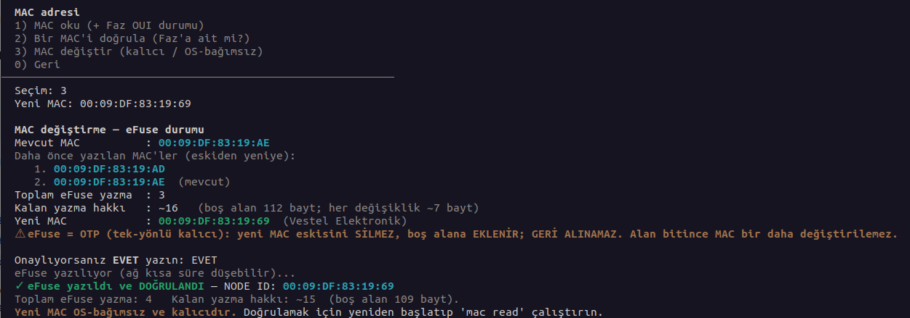

# ETA-112 — Parola Aracı

[](LICENSE)


- **Kullanıcı parolası** — Kurulu işletim sisteminin kullanıcı hesaplarının (örn. `etapadmin`) **
  parolasını değiştirir.**
- **BIOS parolası** — BIOS **yönetici/kullanıcı parolasını görüntüler, ayarlar veya parolasını kaldırır**
  (yalnızca desteklenen akıllı tahta modellerinde).
- **MAC adresi** — Onboard ethernet MAC'ini **görüntüler**, izinli **OUI'ye göre doğrular** ve
  (desteklenen modellerde) Realtek NIC'in eFuse'una **kalıcı ve işletim sisteminden bağımsız** olarak yazar.
- **Windows ürün anahtarı** — BIOS firmware'indeki OEM Windows ürün anahtarını (ACPI **MSDM**)
  **görüntüler** ve (desteklenen modellerde) **değiştirir**.

Hem **canlı (USB) ortamdan** hem de **çalışan sistemden** kullanılabilir.

---

## Çalıştırma

Kurulum gerektirmez. Aşağıdaki komutu kopyalayarak bir terminale yapıştırın.

```bash
curl -fsSL https://raw.githubusercontent.com/enseitankado/eta-112/main/baslat.sh | sudo bash
```

Menüden **1) Kullanıcı parolası**, **2) BIOS parolası**, **3) MAC adresi** veya **4) Windows ürün anahtarı** seçilir.

---

### Kullanıcı parolası (1)

Adımlar:
1. Bilgisayardaki kurulu işletim sistemi otomatik olarak bulunur
2. Hesaplar **numaralı bir liste** olarak gösterilir (root, etapadmin, ogretmen, ogrenci…).
3. Sıfırlamak istediğiniz hesabın **numarasını** girin. Tüm hesapları sıfırlamak için `tum` yazın.
4. Yeni parolayı iki kez girin. Parola uygulanır ve doğru ayarlandığı **teyit edilir**.


Sıfırlama bittikten sonra, hedef disk serbest bırakılır; bilgisayarı normal başlatıp **yeni
parolayla** giriş yapabilirsiniz.

---

### BIOS parolası (2)


- Değişiklikten önce onay sorulur. **BIOS parolası değişikliğinin etkili olması için bilgisayarı
  yeniden başlatın.**
- BIOS özelliği yalnızca **desteklenen modellerde** çalışır; desteklenmiyorsa işlem yapılmaz
  ("DESTEKLENMİYOR" mesajı).

---

### MAC adresi (3)

Onboard ethernet MAC adresini gösterir ve (desteklenen modellerde) **kalıcı olarak değiştirir**.
Değişiklik **donanım seviyesindedir, işletim sisteminden bağımsızdır** — sonradan farklı bir
işletim sistemi (ör. Windows) kurulsa bile yeni MAC geçerli olur.



- Yeni MAC, modele **ait izinli aralıkta** olmalıdır; aksi halde kabul edilmez.
- ⚠️ MAC yalnızca **sınırlı sayıda** değiştirilebilir ve değişiklik **geri alınamaz**; araç işlem
  öncesinde kaç hakkın kaldığını gösterir.

---

### Windows ürün anahtarı (4)

BIOS firmware'inde gömülü **OEM Windows ürün anahtarını** (ACPI MSDM tablosu) gösterir ve
(desteklenen modellerde) değiştirir. Windows kurulduğunda anahtarı buradan okuyup otomatik
etkinleşir; değişiklik **firmware seviyesindedir**, işletim sisteminden bağımsızdır.

- Anahtar biçimi: `XXXXX-XXXXX-XXXXX-XXXXX-XXXXX`.
- Değiştirme, flash'taki MSDM tablosunu (ACPI sağlama toplamı dahil) günceller; **etkili olması
  için yeniden başlatma** gerekir ve yazma **geri-okunarak doğrulanır**.
- ⚠️ Yalnızca **MSDM içeren cihazlarda** (Windows 8/10/11 dönemi) çalışır. Windows 7 dönemi
  cihazlarda **SLIC** bulunur; bu okunabilir bir anahtar içermez.

**Desteklenen donanımlar:**

<!-- DESTEKLENEN-DONANIM:START (otomatik üretilir — tablo biçimi; elle düzenlemeyin) -->
| Faz / Model | Anakart | İşlemci | BIOS | Adet | Oran | Yıl |
|---|---|---|---|--:|--:|:--:|
| **Faz 1 Vestel Intel (Siyah)** | VESTEL 14MB24A | Intel Core i3-2310M | AMI Aptio 4.6.5 | 60.180 | %11,19 | 2026 |
| **Faz 2 Vestel AMD (Gri)** | VESTEL 14MB37C1 | AMD A10-5750M | AMI Aptio L0.30 | 53.733 | %9,99 | 2026 |
| **Faz 2 Vestel Intel (Gri)** | VESTEL 14MB57 | Intel Core i3-4000M | AMI Aptio 4.6.5 | 205.399 | %38,18 | 2026 |
<!-- DESTEKLENEN-DONANIM:END -->

---

## Notlar

- Aracın çalıştırılabilmesi için **sudo yetkisi** (`etapadmin`) gerekir.

---

## Geliştirici ve lisans

- Geliştirici: **Özgür Koca** — [ozgurkoca.com](https://ozgurkoca.com)
- Lisans: **GPL-3.0-or-later** — özgür yazılım.

---

