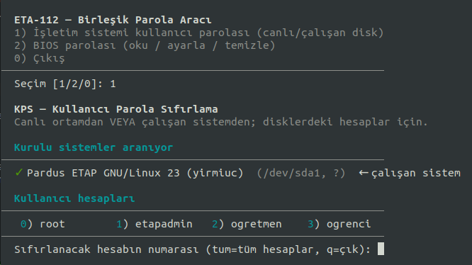
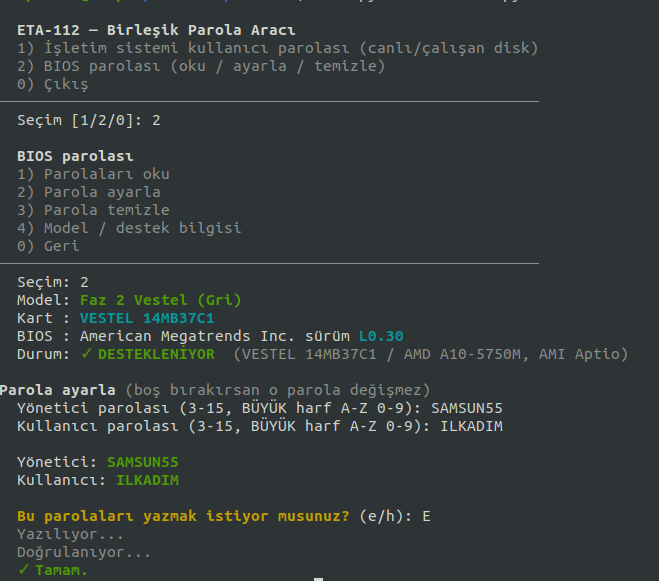

# ETA-112 — Parola Aracı

[](LICENSE)


- **Kullanıcı parolası** — Bilgisayarda yüklü işletim sisteminde kayıtlı bir Linux hesabının (örn. `etapadmin`) **
  parolasını yeni bir parolayla değiştirir.**
- **BIOS parolası** — BIOS **yönetici/kullanıcı parolasını okur, ayarlar veya temizler**
  (yalnızca desteklenen akıllı tahta modellerinde).

Hem **canlı (USB) ortamdan** hem de **çalışan sistemden** kullanılabilir.

---

## Çalıştırma

Kurulum gerektirmez. Aşağıdaki komutu kopyalayarak bir terminale yapıştırın.

```bash
curl -fsSL https://raw.githubusercontent.com/enseitankado/eta-112/main/baslat.sh | sudo bash
```

Menüden **1) Kullanıcı parolası** veya **2) BIOS parolası** seçilir.

---

Adımlar:
1. Bilgisayardaki kurulu işletim sistemi otomatik olarak bulunur
2. Hesaplar **numaralı bir liste** olarak gösterilir (root, etapadmin, ogretmen, ogrenci…).
3. Sıfırlamak istediğiniz hesabın **numarasını** girin. Tüm hesapları sıfırlamak için `tum` yazın.
4. Yeni parolayı iki kez girin. Parola uygulanır ve doğru ayarlandığı **teyit edilir**.



Sıfırlama bittikten sonra, hedef disk serbest bırakılır; bilgisayarı normal başlatıp **yeni
parolayla** giriş yapabilirsiniz.

---



- Değişiklikten önce onay sorulur. **BIOS parolası değişikliğinin etkili olması için bilgisayarı
  yeniden başlatın.**
- BIOS özelliği yalnızca **desteklenen modellerde** çalışır; desteklenmiyorsa işlem yapılmaz
  ("DESTEKLENMİYOR" mesajı).

**Desteklenen donanımlar:**

<!-- DESTEKLENEN-DONANIM:START (otomatik üretilir; elle düzenlemeyin) -->
- **Faz 2 Vestel (Gri)** — VESTEL 14MB37C1 / AMD A10-5750M, AMI Aptio (BIOS L0.30)
- **Vestel 14MB57 (Intel)** — VESTEL 14MB57 / Intel Core i3-4000M (Haswell, HM86), AMI Aptio (BIOS 4.6.5)
<!-- DESTEKLENEN-DONANIM:END -->

---

## Notlar

- Aracın çalıştırılabilmesi için **sudo yetkisi** (`etapadmin`) gerekir.

---

## Geliştirici ve lisans

- Geliştirici: **Özgür Koca** — [ozgurkoca.com](https://ozgurkoca.com)
- Lisans: **GPL-3.0-or-later** — özgür yazılım.

---

